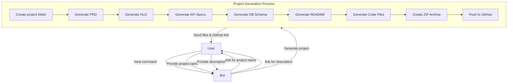
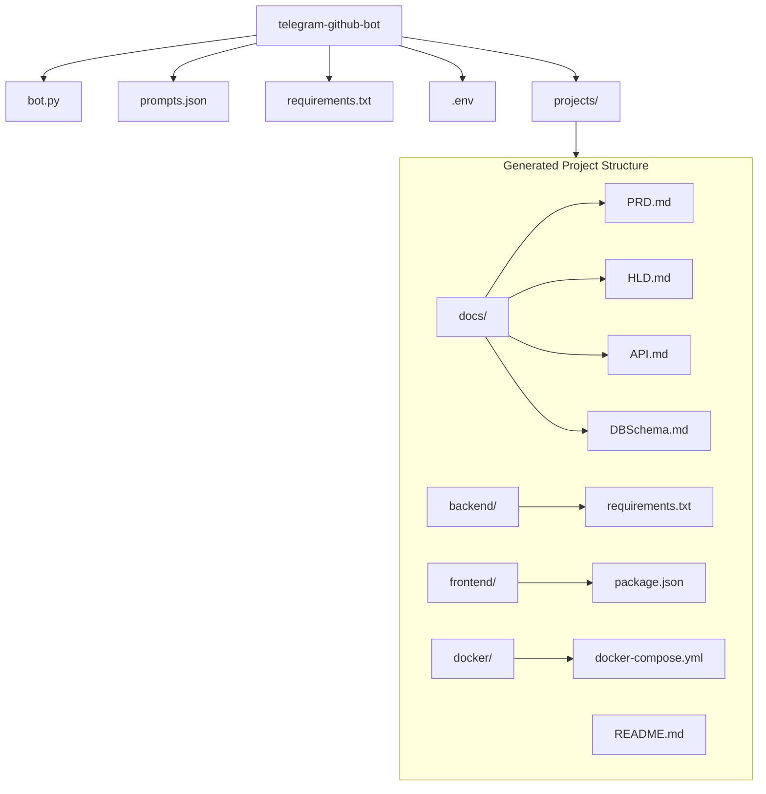
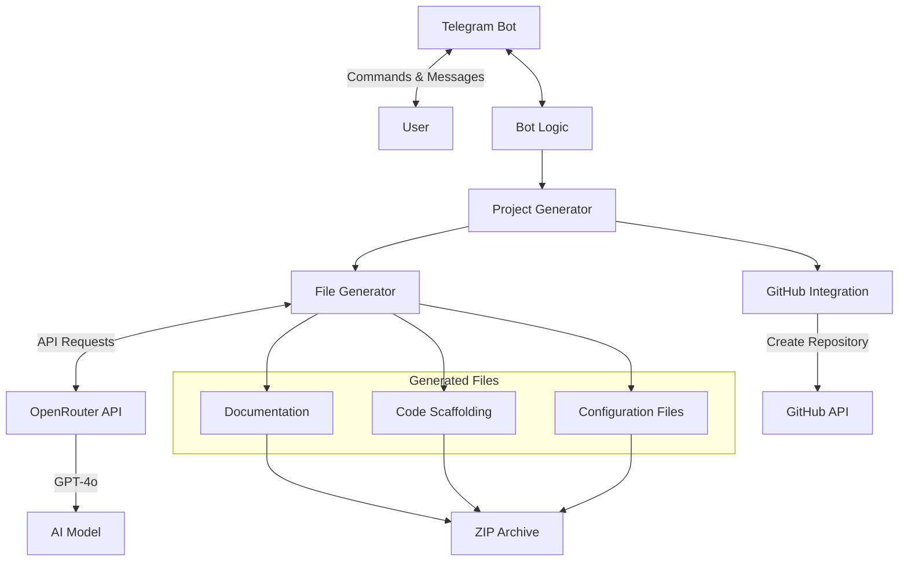
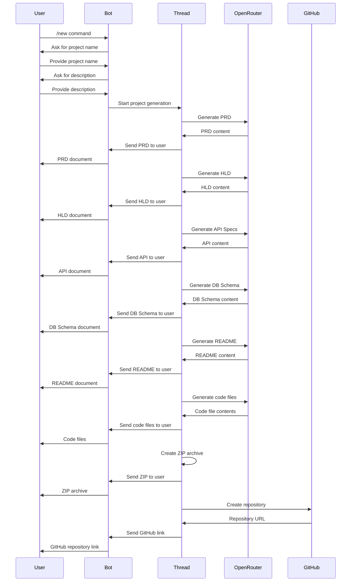

# Telegram GitHub Bot

<div align="center">


A Telegram bot that generates AI-powered project scaffolding and pushes it to GitHub.

[](https://twitter.com/justmalhar)
[](https://www.linkedin.com/in/justmalhar/)
[](https://github.com/Justmalhar)
[](https://railway.app/new/template?template=https://github.com/Justmalhar/telegram-github-agent)

</div>

## 🌟 Features

- Create new projects with a simple conversation flow
- Generate comprehensive documentation (PRD, HLD, API specs, DB schema)
- Generate code scaffolding for frontend and backend
- Automatically create GitHub repository with the generated files
- Package the project as a ZIP file
- Uses OpenRouter API for AI model access

## 🔄 How It Works



## 📂 Project Structure



## 🏗️ Architecture



## 🛠️ Requirements

- Python 3.8+
- Telegram Bot Token
- OpenRouter API Key
- GitHub Personal Access Token

## 📋 Installation

1. Clone this repository:
   ```bash
   git clone https://github.com/Justmalhar/telegram-github-bot.git
   cd telegram-github-bot
   ```

2. Install dependencies:
   ```bash
   pip install -r requirements.txt
   ```

3. Set up environment variables:
   
   Copy the example environment file and fill in your credentials:
   ```bash
   cp .env.example .env
   ```
   
   Then edit the `.env` file with your actual API keys:
   ```
   TELEGRAM_BOT_TOKEN=your_telegram_bot_token
   OPENROUTER_API_KEY=your_openrouter_api_key
   GITHUB_TOKEN=your_github_personal_access_token
   ```

## 🚀 Usage

1. Test the configuration:
   ```bash
   python bot.py --test
   ```

2. Start the bot:
   ```bash
   python bot.py
   ```

3. In Telegram, start a conversation with your bot
4. Use the `/new` command to create a new project
5. Follow the prompts to specify project name and description
6. The bot will generate all necessary files and create a GitHub repository

## 🐳 Docker

Build the image and run the bot in a container:

```bash
docker build -t telegram-github-bot .
docker run --env-file .env telegram-github-bot
```

## 🚄 One-Click Deploy on Railway

You can deploy this bot directly to Railway. Click the button at the top of this
README or use the link below:

<https://railway.app/new/template?template=https://github.com/Justmalhar/telegram-github-agent>

After the project is created, add the environment variables from `.env.example`
to the Railway dashboard and deploy.

## 📁 Project Structure

- `bot.py`: Main bot code
- `prompts.json`: Templates for AI generation prompts
- `requirements.txt`: Python dependencies
- `projects/`: Directory where generated projects are stored

## 🔧 Customization

You can customize the AI prompts by editing the `prompts.json` file. The following templates are available:

| Template | Description |
|----------|-------------|
| `prd_prompt` | Product Requirements Document |
| `hld_prompt` | High-Level Design |
| `api_prompt` | API Specification |
| `dbschema_prompt` | Database Schema |
| `readme_prompt` | Project README |
| `requirements_prompt` | Backend requirements.txt |
| `packagejson_prompt` | Frontend package.json |
| `docker_prompt` | Docker configuration |

## 🤖 OpenRouter Configuration

This bot uses OpenRouter to access various AI models. OpenRouter provides:

- Access to multiple AI models through a single API
- Competitive pricing
- Fallback options if a model is unavailable

You can get an API key from [OpenRouter](https://openrouter.ai/).

## 🔄 Bot Workflow



## 📄 License

MIT

---

## Connect With Me 

<div align="center">
  <p>Created by <a href="https://twitter.com/justmalhar">@justmalhar</a> | <a href="https://www.linkedin.com/in/justmalhar/">LinkedIn</a></p>
</div>